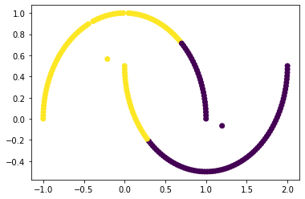
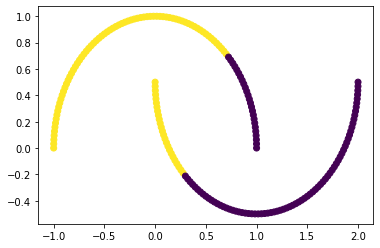
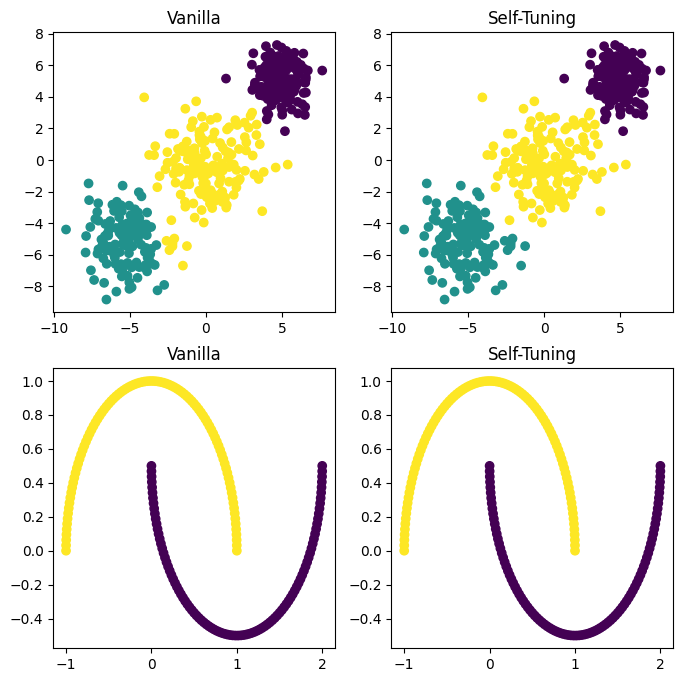

# README
Three clustering ways: K-means, Fuzzy C-means and Self-tuning Spectral Clustering(STSC)

## Lib
```bash
pip install pandas numpy scikit-learn matplitlib
```

## Results
K-means:


FCM:


Vanilla Spectral Clustering vs Self-tuning Spectral Clustering
